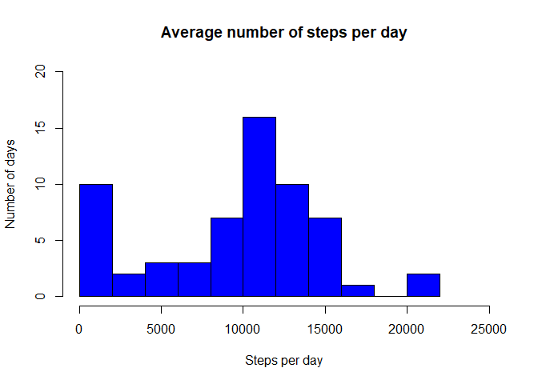
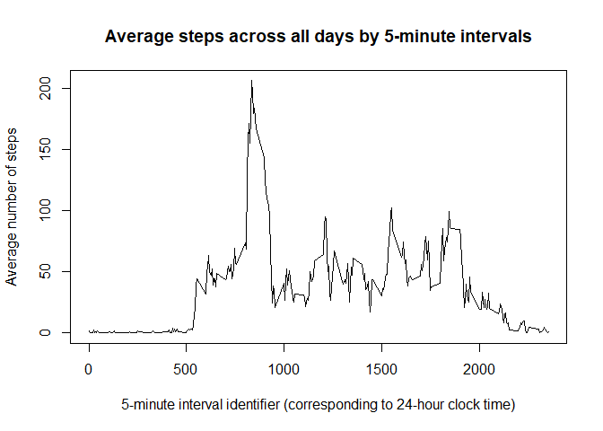
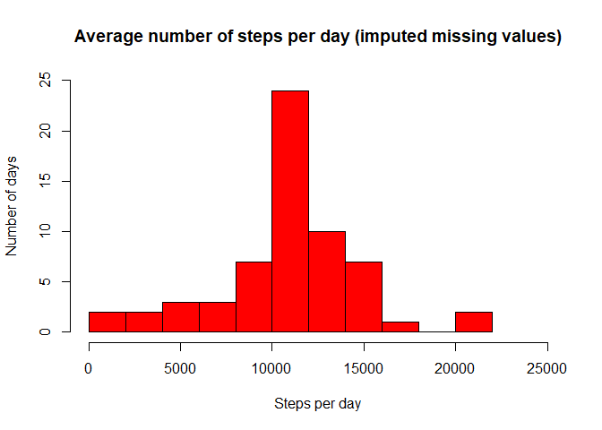
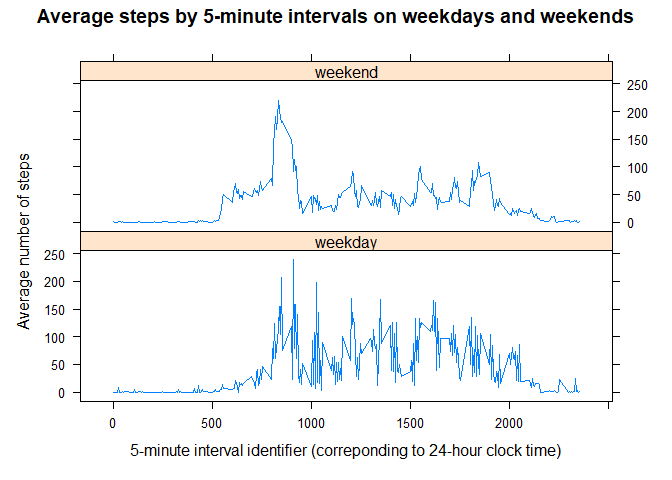

## Introduction
It is now possible to collect a large amount of data about personal movement using activity monitoring devices such as a Fitbit, Nike Fuelband, or Jawbone Up.  
This assignment makes use of data from a personal activity monitoring device which collects data at 5 minute intervals through out the day. The data consists of two months of data from an anonymous individual collected during the months of October and November, 2012 and include the number of steps taken in 5 minute intervals each day.  
This report shows how you can explore the data and get results from it with all of the analysis process described by text and R code using a single R Markdown file.  
The data was obtained by forking and cloning a provided repo on GitHub. 

## Loading and preprocessing the data

```r
unzip("activity.zip")
actdata <- read.csv("activity.csv")
```

A data set of 17,568 observations of 3 variables (steps, date, interval) is generated and can now be explored.

## What is mean total number of steps taken per day?

First, the total number of steps for each day is calculated.


```r
splitdate <- tapply(actdata$steps, actdata$date, sum, na.rm = TRUE)
```

Next, the total number of steps are plottet in a histogram to show the distribution of the number of steps taken per day during the two month period.


```r
hist(splitdate, main = "Average number of steps per day", xlab = "Steps per day", ylab = "Number of days", col = "blue", ylim = c(0,20), xlim = c(0,25000), breaks = 12)
```

<!-- -->

Lastly, the mean and median total number of steps per day are calculated.


```r
mean(splitdate, na.rm = TRUE)
```

```
## [1] 9354.23
```

```r
median(splitdate, na.rm = TRUE)
```

```
## [1] 10395
```

## What is the average daily activity pattern?
The number of steps for each of the 5-minute intervals across all days is calculated.


```r
splitint <- tapply(actdata$steps, actdata$interval, mean, na.rm = TRUE)
```

A time series plot is now made with the 5-minute intervals on the x-axis and the mean number of steps across all days during the intervals on the y-axis.


```r
df_timeint <- data.frame(unique(actdata$interval), splitint)
plot(df_timeint$unique.actdata.interval., df_timeint$splitint, type = "l", xlab = "5-minute interval identifier (corresponding to 24-hour clock time)", ylab = "Average number of steps", main = "Average steps across all days by 5-minute intervals")
```

<!-- -->

The 5-minute interval with maximum steps is found by subsetting the data.


```r
df_timeint$unique.actdata.interval.[df_timeint$splitint == max(splitint)]
```

```
## [1] 835
```
The 5-minute interval on average across all days where most steps are taken is 835 corresponding to 8:35 AM. 

## Imputing missing values
Because missing values (NA's) may introduce bias into some calculations or summaries of the data, a strategy to overcome this is to replace the NA's by filling in appropriate mean or median values.

The total number of NA's is calculated.


```r
sum(is.na(actdata$steps))
```

```
## [1] 2304
```

The 2304 NA's will be replaced by the mean value of steps across all days for the corresponding 5-minute interval (values of 'splitint' from previous assignment).  
The 'dplyr' package is used for these operations.  

First, the activity data is divided into two separate data frames; one containing the data with NA values in the 'steps' column and the other without NA values.
The NA-containing data is then merged with the previously constructed dataframe, 'df_timeint', containing the average number of steps for each of the 5-minute intervals. The extra column of the merged data is filled in with the average number of steps according to the specific interval. The orginal 'steps' column with all NA's can be deleted.
Using rbind, the merged dataframe is combined with the data set without NA's and the new data frame with imputed missing values is complete.


```r
install.packages("dplyr", repos = "http://cran.us.r-project.org")
library(dplyr)
```

```r
na_data <- actdata[is.na(actdata$steps), ]
nona_data <- actdata[!is.na(actdata$steps), ]

colnames(df_timeint) <- c("interval", "splitint")
mergeddf <- merge(na_data, df_timeint, by = "interval")

mergeddf <- select(mergeddf, -steps)
colnames(mergeddf) <- c("interval", "date", "steps")

newdf <- rbind.data.frame(mergeddf, nona_data)
```

It is checked that there are no NA any more:

```r
sum(is.na(newdf$steps))
```

```
## [1] 0
```

From the new data frame with imputed missing values, a new histogram is made, displaying the mean total number of steps each day (same code basis as used in assignment 2).

```r
nona_splitdate <- tapply(newdf$steps, newdf$date, sum)
```

```r
hist(nona_splitdate, main = "Average number of steps per day (imputed missing values)", xlab = "Steps per day", ylab = "Number of days", col = "red", ylim = c(0,25), xlim = c(0,25000), breaks = 12)
```

<!-- -->

Again, the mean and median total number of steps per day are calculated.

```r
mean(nona_splitdate)
```

```
## [1] 10766.19
```

```r
median(nona_splitdate)
```

```
## [1] 10766.19
```
When missing values are imputed, it is seen from both the histograms and the mean and median values that the number of days without any steps taken are reduced and that there are more days with an average number of steps. This makes sense, as all NA's were replaced by the mean value of steps, which is also seen from the mean which is no longer smaller than the median but equal to it.

## Are there differences in activity patterns between weekdays and weekends?

The values of the 'date' column in the new data frame with imputed NA's is used to create a new column with the corresponding weekdays. The data frame is split in two, one containing the two weekend days ('saturday' is "lørdag" and 'sunday' is "søndag" in Danish) and another with the five weekdays. An extra column is added with the value "weekend" or "weekday, respectively, the original weekday column is deleted, the two data frames are re-combined, and the new 'day_type' variable is converted to a factor variable.

```r
weekdays <- weekdays(as.Date(newdf$date))
newdf2 <- cbind(newdf, weekdays)
newdf2_wd <- filter(newdf2, weekdays == c("lørdag", "søndag"))
newdf2_we <- filter(newdf2, weekdays != c("lørdag", "søndag"))

col_weekdays <- rep("weekday", times = nrow(newdf2_wd))
col_weekends <- rep("weekend", times = nrow(newdf2_we))

newdf2_wd$weekdays <- col_weekdays
newdf2_we$weekdays <- col_weekends

df_daytype <- rbind.data.frame(newdf2_wd, newdf2_we)
names(df_daytype)[names(df_daytype) == "weekdays"] <- "day_type"

df_daytype$day_type <- as.factor(df_daytype$day_type)
```

From this new data frame, the average steps by time interval and day type are calculated and a panel plot with time series plots for each day type is made.


```r
install.packages("lattice", repos = "http://cran.us.r-project.org")
library(lattice)
```

```r
splitsteps <- aggregate(steps ~ interval + day_type, df_daytype, mean)
```

```r
xyplot(steps ~ interval | day_type, splitsteps, type = "l", layout = c(1, 2), 
    xlab = "5-minute interval identifier (correponding to 24-hour clock time)", ylab = "Average number of steps", main = "Average steps by 5-minute intervals on weekdays and weekends")
```

<!-- -->
